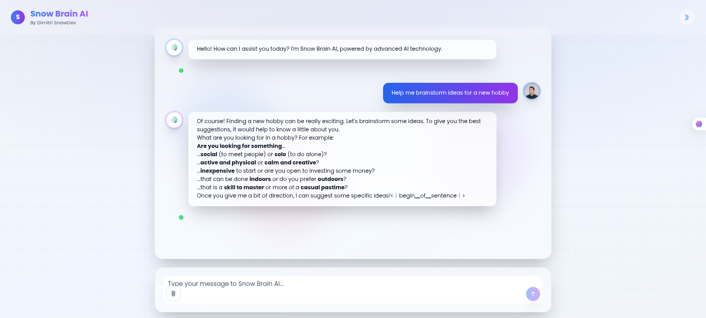

# 🧠 Snow Brain AI - Advanced Multimodal AI Assistant

<div align="center">
  
</div>

<div align="center">
  <h3>✨ Experience the future of AI conversation with advanced multimodal capabilities ✨</h3>
</div>

---

Snow Brain AI is a cutting-edge, full-screen AI chatbot that delivers real-time responses using the **OpenRouter API** with the powerful **DeepSeek Chat v3.1** model. This project features a stunning futuristic interface with glassmorphism effects, designed for seamless and immersive AI conversations.

## 🌟 Key Features

### 🎨 **Stunning Visual Design**
- **Full-Screen Immersive Interface**: Utilizes every pixel for a premium experience
- **Glassmorphism Effects**: Modern transparent panels with backdrop blur
- **Animated Background**: Floating orbs with smooth blob animations
- **Gradient Themes**: Beautiful light and dark mode with gradient backgrounds
- **Custom Snow Brain Logo**: Branded AI assistant with distinctive brain-snowflake design

### 🚀 **Advanced AI Capabilities**
- **Real-time Streaming**: Messages stream in real-time for natural conversation flow
- **Conversation Memory**: Maintains complete context throughout the session
- **Language Control**: Built-in system prompts ensure consistent English responses
- **Smart Responses**: Powered by DeepSeek Chat v3.1 for intelligent conversations
- **Error Handling**: Robust error management with graceful fallbacks

### 📎 **Multimodal Input System**
- **File Attachments**: Support for images, documents, videos, and PDFs
- **Drag & Drop**: Intuitive file upload with preview thumbnails
- **File Management**: Easy attachment removal with hover controls
- **Size Validation**: Automatic file size checking (25MB limit)
- **Upload Progress**: Visual feedback during file processing

### 💫 **Interactive Elements**
- **Suggested Actions**: Smart conversation starters when chat is empty
- **Auto-resizing Input**: Textarea grows with content automatically
- **Hover Effects**: Beautiful interactive feedback throughout the UI
- **Smooth Animations**: Framer Motion powered transitions
- **Copy & Regenerate**: Easy message copying and response regeneration

## 🛠️ Technologies & Architecture

### **Frontend Stack**
- **React 18** with TypeScript for type safety
- **shadcn/ui** component library for consistent design
- **Tailwind CSS** with custom utilities and glassmorphism effects
- **Framer Motion** for smooth animations and transitions
- **Lucide React** for beautiful, consistent icons

### **AI Integration**
- **OpenRouter API** for accessing advanced AI models
- **DeepSeek Chat v3.1** (free tier) for intelligent responses
- **Native Fetch API** for HTTP requests with streaming support
- **Conversation Management** with automatic memory trimming

### **Development Tools**
- **Vite** for fast development and building
- **TypeScript** for enhanced development experience
- **ESLint** for code quality and consistency
- **PostCSS** with Autoprefixer for CSS processing

## 🚀 Quick Start

### Prerequisites
- **Node.js** (version 18 or higher)
- **npm** or **yarn** package manager
- **OpenRouter API Key** (get yours at [openrouter.ai](https://openrouter.ai))

### Installation & Setup

1. **Clone the repository**
   ```bash
   git clone https://github.com/yourusername/Snow-Brain-Ai.git
   cd Snow-Brain-Ai
   ```

2. **Install dependencies**
   ```bash
   npm install
   # or
   yarn install
   ```

3. **Environment Configuration**
   
   Create a `.env` file in the root directory:
   ```env
   VITE_OPENROUTER_API_KEY=your_openrouter_api_key_here
   ```

4. **Start development server**
   ```bash
   npm run dev
   # or
   yarn dev
   ```

5. **Open your browser**
   
   Navigate to `http://localhost:5173` and experience Snow Brain AI!

## 📱 Usage Guide

### **Starting a Conversation**
- Click any of the suggested action buttons to begin
- Or simply type your message in the chat input
- Files can be attached via drag & drop or the attachment button

### **File Attachments**
- **Supported formats**: Images (PNG, JPG, GIF), Videos (MP4, AVI), Documents (PDF, TXT)
- **Size limit**: 25MB per file
- **Preview**: Thumbnails are generated automatically
- **Management**: Hover over attachments to remove them

### **Theme Switching**
- Toggle between light and dark modes using the theme button
- Both themes feature beautiful gradient backgrounds
- All text remains perfectly visible in both modes

### **Advanced Features**
- **Copy messages**: Click the copy icon on any AI response
- **Regenerate**: Re-run the last AI response with the refresh button
- **Memory**: The AI remembers your entire conversation
- **Streaming**: Watch responses appear in real-time

## 🎨 Design Philosophy

Snow Brain AI embraces a **futuristic, immersive design** philosophy:

- **Full-Screen Experience**: No wasted space, every pixel serves the conversation
- **Glassmorphism**: Transparent elements with beautiful backdrop blur effects
- **Motion Design**: Subtle animations that enhance rather than distract
- **Brand Identity**: Consistent Snow Brain logo and color scheme throughout
- **Accessibility**: Dual-theme support ensures readability in any lighting condition

## 🔧 API Configuration

### **Model Selection**
Currently using **DeepSeek Chat v3.1** for its excellent balance of:
- **Quality**: High-quality responses with reasoning capabilities
- **Speed**: Fast response times for real-time interaction
- **Cost**: Free tier available through OpenRouter
- **Reliability**: Stable and consistent performance

### **Conversation Management**
- **Context Window**: Automatically managed to stay within model limits
- **Memory Trimming**: Oldest messages removed when approaching limits
- **System Prompts**: Consistent English responses and helpful behavior

## 🚀 Deployment

### **Build for Production**
```bash
npm run build
# or
yarn build
```

### **Deploy to Vercel** (Recommended)
1. Connect your GitHub repository to Vercel
2. Add your `VITE_OPENROUTER_API_KEY` environment variable
3. Deploy automatically with every push

### **Deploy to Netlify**
1. Build the project locally: `npm run build`
2. Upload the `dist` folder to Netlify
3. Configure environment variables in Netlify dashboard

## 🗺️ Roadmap & Future Features

Snow Brain AI is continuously evolving! Here's what's coming next and how you can contribute:

### 🔥 **High Priority Features**

#### 🧠 **Memory & Context Management**
- **Persistent Conversation Memory**: Save conversations across browser sessions
- **Smart Context Management**: Intelligent trimming while preserving important context
- **Conversation Export/Import**: Download and restore conversation history
- **Memory Search**: Search through previous conversations and responses

#### 🔐 **Authentication & User Profiles**
- **User Authentication**: Secure login with email or social providers
- **Profile Customization**: Personal avatars, themes, and preferences
- **Cross-Device Sync**: Access conversations from any device
- **Privacy Controls**: Advanced settings for data privacy and sharing

#### 🎙️ **Voice & Audio Features**
- **Voice Input**: Speech-to-text for hands-free interaction
- **Voice Responses**: Text-to-speech with natural-sounding voices
- **Audio Messages**: Send and receive voice messages
- **Voice Commands**: Navigate the interface with voice controls

### 🎯 **Medium Priority Features**

#### 🤖 **Advanced AI Capabilities**
- **Multi-Model Support**: Choose between GPT-4, Claude, Gemini, and more
- **AI Personas**: Pre-configured personalities (Assistant, Teacher, Coder, etc.)
- **Custom System Prompts**: Tailor AI behavior for specific use cases
- **Function Calling**: Integration with external APIs and tools
- **Temperature Control**: Adjust creativity and randomness settings

#### 🎨 **Enhanced UI/UX**
- **Custom Themes**: User-created color schemes and layouts
- **Message Reactions**: React to messages with emojis
- **Rich Text Formatting**: Bold, italic, code blocks, and more
- **Typing Indicators**: Real-time feedback during AI generation
- **Message Timestamps**: Detailed conversation timeline

#### 📱 **Mobile & Accessibility**
- **Progressive Web App**: Full offline support and mobile installation
- **Enhanced Mobile UI**: Touch gestures and mobile-optimized interface
- **Accessibility Features**: Screen reader support and keyboard navigation
- **Internationalization**: Multi-language support for global users

### 🔧 **Developer & Power User Features**

#### 🛠️ **Advanced Functionality**
- **Plugin System**: Extensible architecture for third-party integrations
- **API Access**: RESTful API for external applications
- **Webhook Support**: Real-time notifications and integrations
- **Admin Dashboard**: Analytics, user management, and system monitoring

#### 🧪 **Quality & Performance**
- **Comprehensive Testing**: Unit, integration, and E2E test coverage
- **Performance Monitoring**: Real-time performance metrics and alerts
- **Error Tracking**: Advanced error reporting and debugging tools
- **Rate Limiting**: Smart usage controls and optimization

## 🤝 Contributing

We welcome contributions from developers of all skill levels! Check out our **[CONTRIBUTING.md](CONTRIBUTING.md)** for detailed guidelines.

### **Quick Start for Contributors**
1. **Fork the repository**
2. **Create a feature branch**: `git checkout -b feature/amazing-feature`
3. **Read [CONTRIBUTING.md](CONTRIBUTING.md)** for detailed setup instructions
4. **Check [Issues](https://github.com/DimitriTedom/Snow-Brain-Ai/issues)** for tasks marked `good-first-issue`
5. **Join [Discussions](https://github.com/DimitriTedom/Snow-Brain-Ai/discussions)** to connect with the community

### **Development Guidelines**
- Follow TypeScript best practices and use proper type definitions
- Maintain the glassmorphism design language and theme consistency
- Test thoroughly in both light and dark modes
- Ensure mobile responsiveness across all components
- Document any new features with JSDoc comments
- Write comprehensive tests for new functionality

### **Priority Contribution Areas**
- 🧠 **Memory System**: Help implement persistent conversation storage
- 🔐 **Authentication**: Build secure user management features  
- 🎙️ **Voice Features**: Add speech-to-text and text-to-speech capabilities
- 📱 **Mobile UX**: Enhance the mobile experience and PWA features
- 🧪 **Testing**: Improve test coverage and quality assurance
- 📚 **Documentation**: Create tutorials and improve existing docs

## 📄 License

This project is licensed under the **MIT License** - see the [LICENSE](LICENSE) file for details.

## 🙏 Acknowledgments

- **OpenRouter** for providing access to advanced AI models
- **DeepSeek** for their powerful and accessible AI technology
- **shadcn/ui** for the beautiful component library
- **Tailwind CSS** for the utility-first styling approach
- **Framer Motion** for smooth and delightful animations

---

<div align="center">
  <h3>🌟 Experience the future of AI conversation today! 🌟</h3>
  <p>Built with ❤️ by the Snow Brain AI team</p>
</div>

## 📋 Prerequisites

Before running this project, make sure you have:

- Node.js installed (version 16.x or higher)
- An OpenRouter account with API access
- A valid OpenRouter API key for authentication

## 🚀 Installation

1. Clone the repository:
   ```bash
   git clone https://github.com/DimitriTedom/Snow-Brain-Ai.git
   ```

2. Navigate to the project directory:
   ```bash
   cd Snow-Brain-Ai
   ```

3. Install dependencies:
   ```bash
   npm install
   ```

4. Configure environment variables:
   Create a `.env.local` file in the project root and add your OpenRouter API key:
   ```env
   VITE_OPENROUTER_API_KEY=your_openrouter_api_key_here
   ```

5. Get your OpenRouter API key:
   - Visit [OpenRouter.ai](https://openrouter.ai/)
   - Sign up for a free account
   - Generate your API key from the dashboard
   - The project uses the free `deepseek/deepseek-chat-v3.1:free` model

## 🏃‍♂️ Running the Project

1. Start the development server:
   ```bash
   npm run dev
   ```

2. Open your browser and visit:
   [http://localhost:5174](http://localhost:5174)

## 💡 Usage

### Basic Chat
- Type your message in the enhanced multimodal input field
- Press Enter or click the send button to interact with Snow Brain AI
- Enjoy real-time responses with streaming via the OpenRouter API

### File Attachments
- Click the paperclip icon to attach files (images, documents, videos)
- Preview attachments before sending
- Remove attachments by hovering and clicking the X button

### Suggested Actions
- Use the suggested conversation starters when the chat is empty
- Click on any suggested action to quickly start a conversation

### Advanced Features
- **Dark/Light Mode**: Toggle between themes using the mode switcher
- **Conversation Memory**: The AI remembers the entire conversation context
- **Copy/Regenerate**: Hover over AI messages to copy or regenerate responses

## 🏗️ Project Structure

```
src/
├── components/
│   ├── ui/                     # shadcn/ui components
│   │   ├── multimodal-ai-chat-input.tsx  # Enhanced chat input
│   │   ├── chat-bubble.tsx     # Chat message bubbles
│   │   ├── avatar.tsx          # User/AI avatars
│   │   └── button.tsx          # Action buttons
│   ├── Chat/                   # Main chat component
│   ├── Controls/               # Legacy controls (replaced)
│   ├── Loader/                 # Loading indicators
│   └── DarkModeToggle.tsx      # Theme switcher
├── assistants/
│   └── openrouter.ts           # OpenRouter API integration
└── App.tsx                     # Main application component
```

## 🎨 Key Components

### `PureMultimodalInput`
The core multimodal chat input component featuring:
- Auto-resizing textarea
- File attachment system
- Suggested conversation starters
- Send/stop controls
- Smooth animations with Framer Motion

### `OpenRouterAssistant`
Advanced AI assistant class with:
- Conversation memory management
- System prompt configuration
- Streaming response handling
- English language enforcement

### `Chat`
Enhanced chat display component with:
- Glassmorphism design
- Message grouping
- Loading indicators
- Copy/regenerate actions

## 👨‍💻 Author

This project was created by **Tedom Tafotsi Dimitri Wilfried**, aka **SnowDev**.

- **LinkedIn**: [Tedom Tafotsi Dimitri Wilfried](https://www.linkedin.com/in/tedom-tafotsi-dimitri-wilfried-b70502298/)
- **X (formerly Twitter)**: [@DimitriTedom](https://x.com/DimitriTedom)
- **Email**: [dimitritedom@gmail.com](mailto:dimitritedom@gmail.com)

## 🤝 Contributing

Contributions are welcome! If you'd like to contribute:

1. Fork the project
2. Create a feature branch:
   ```bash
   git checkout -b feature/amazing-feature
   ```
3. Commit your changes:
   ```bash
   git commit -m "Add amazing feature"
   ```
4. Push to the branch:
   ```bash
   git push origin feature/amazing-feature
   ```
5. Open a Pull Request

## 📄 License

This project is licensed under the [MIT](LICENSE) License.

## 🙏 Acknowledgments

- **shadcn/ui** for the beautiful component library
- **OpenRouter** for providing access to advanced AI models
- **DeepSeek** for the powerful Chat v3.1 model
- **Framer Motion** for smooth animations

---

**Thank you for using Snow Brain AI! 🚀**

*Experience the future of AI conversation with advanced multimodal capabilities.*

